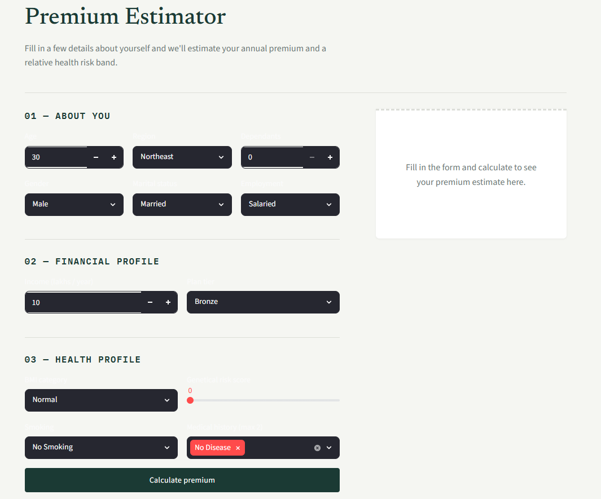
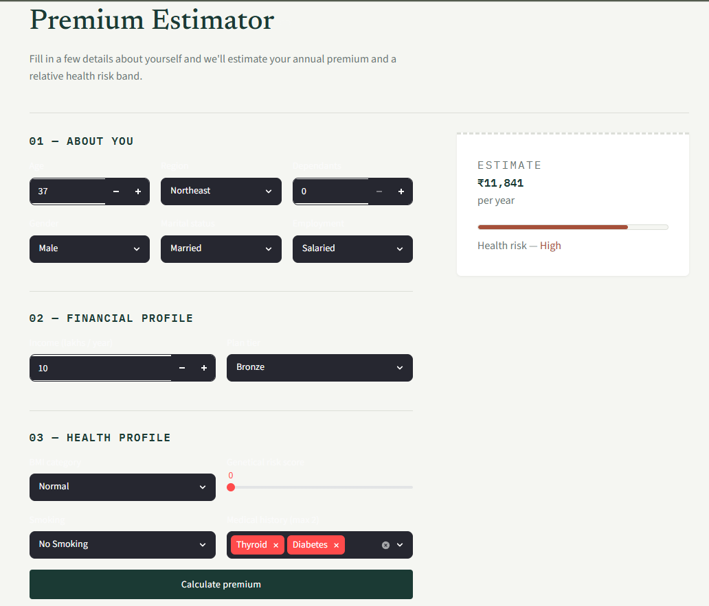

# 🏥 Health Insurance Price Prediction

An end-to-end Machine Learning application that estimates annual health insurance premiums based on personal, financial, and health-related information.

🚀 **Live Demo**
**https://health-insurance-price-prediction-wiwziygrcx93cjzcwv4jg3.streamlit.app**

---

## ✨ Features

* Interactive Streamlit application
* Real-time premium prediction
* Dual XGBoost regression models
* Automatic model selection based on age
* Health risk estimation

---

## 🛠️ Tech Stack

* Python
* Streamlit
* XGBoost
* Scikit-learn
* Pandas
* NumPy
* Joblib

---

## 📁 Project Structure

```text
health-insurance-price-prediction/
│
├── artifacts/
├── screenshots/
├── main.py
├── prediction_helper.py
├── requirements.txt
├── README.md
└── .gitignore
```

---

## 📸 Application Preview

### Premium Estimator



### Prediction Result



---

## 👨‍💻 Author

**Jithesh J Poojary**

* **GitHub:** https://github.com/jitheshpoojary
* **LinkedIn:** https://www.linkedin.com/in/jeethesh-j-poojary/

---

⭐ Feel free to explore the application and try different inputs using the live demo.
